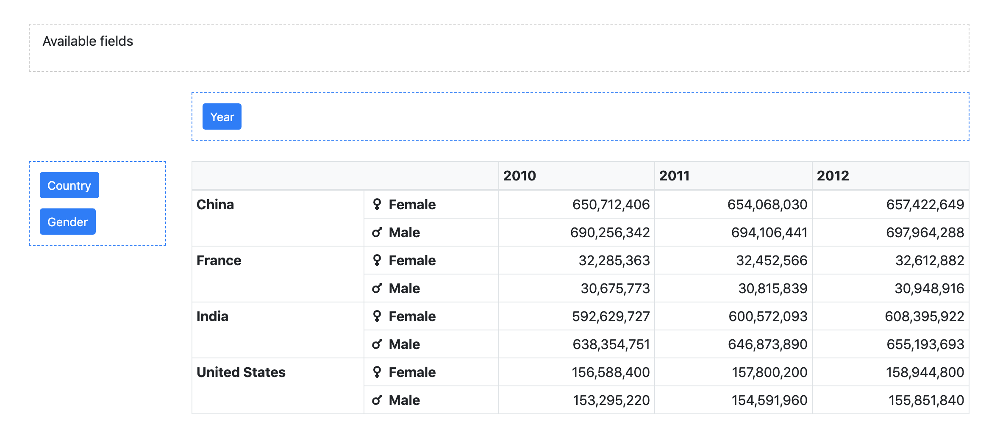

# vue-pivot
A customized vue component for pivot table.

This project is modified based on [vue-pivot-table](https://github.com/MarketConnect/vue-pivot-table) to adjust its design to our products and add custom features described below.



### Customized features
- Used `v-model` to bind row / column fields
  - And get these states reactively
- Reset row / column fields
- Download the current pivotted table in CSV / TSV
- Sortable rows
- Design updates
  - Shrinked buttons and table

## Install

`npm install --save @linecorp/vue-pivot` (temp)

## Usage

The component `Pivot` has an aggregation table (referred to as `PivotTable`) from data & specific rows/columns.

`Pivot` has also a drag & drop user interface to configure rows/columns of a `PivotTable`.

```html
<!-- App.vue (template) -->
<template>
  <div id="app">
  ...

    <pivot
      :data="data"
      v-model="fields"
      :reducer="reducer"
      :showSettings="defaultShowSettings"
      >
    </pivot>
  ...

</template>
```

```js
/* App.vue (js)*/
// Import the needed component(s)
import Vue from 'vue'
import { Pivot } from '@linecorp/vue-pivot'

export default Vue.extend({
  name: "app",
  components: { Pivot },
  data: () => {
    return {
      data: Object.freeze([{ x: 0, y: 0, z: 0 }, { x: 1, y: 1, z: 1 }]),
      fields: {
        availableFields: [],
        rowFields: [{
          getter: item => item.x,
          label: 'X-axis'
        }, {
          getter: item => item.y,
          label: 'Y-axis',
        }],
        colFields: [{
          getter: item => item.z,
          label: 'Z-axis'
        }],
      },
      reducer: (sum, item) => sum + 1,
      defaultShowSettings: true,
      tableHeight: '400px'
    }
  }
  ...
})
```

```js
/* main.js */
import Vue from "vue"
import 'bootstrap'
import 'bootstrap/dist/css/bootstrap.min.css'
import BootstrapVue from 'bootstrap-vue'
import App from './App.vue'

Vue.use(BootstrapVue)

new Vue({
  render: h => h(App)
}).$mount("#app")

```

## API

### Props

Prop | Type | Default | Description
-----|------|---------|------------
`data` | `Array` | `[]` | Dataset to use in the pivot ; each element should be an object
`fields` | `Object (v-model)` | `[]` | Information about pivot table. It includes available fields, row fields, column fields. You can receive the change of these information by watching this fields. Please consult the above example for usage.
`reducer` | `function` | `(sum, item) => sum + 1` | Function applied to reduce `data` in the pivot table
`tableHeight` | `Number` | `500px` | The height of table
`default-show-settings` | `Boolean` | `true` | Show settings at component creation
`no-data-warning-text` | `String` | `'No data to display.'` | Text to display when `data` is empty
`is-data-loading` | `Boolean` | `false` | Display a loading content instead of the table when the value is `true` (see slots for customization)
`available-fields-label-text` | `String` | `'Available fields'` | Text for available fields drag area
`rows-label-text` | `String` | `'Rows'` | Text for the rows drag area
`cols-label-text` | `String` | `'Columns'` | Text for the columns drag area
`hide-settings-text` | `String` | `'Hide settings'` | Text for the "hide settings" button
`show-settings-text` | `String` | `'Show settings'` | Text for the "show settings" button

#### Field format

Each element in the arrays `fields`, `colFields` or `rowFields` should be an Object with this format:

Prop | Type | Description
-----|------|------------
`label` | `String` | Text to display in the draggable button (`Pivot` only)
`getter` | `Function` | Function to apply on an element of `data` to get the field value
`sort` | `Function` | Optional - Function to order fields in the pivot table header ; if no value is provided, [javascript-natural-sort](https://github.com/Bill4Time/javascript-natural-sort) will be applied
`showHeader` | `Boolean` | Optional (default: `true`) - Whether the header should be displayed in the pivot table
`showFooter` | `Boolean` | Optional (default: `false`) - Whether the footer should be displayed in the pivot table
`headerSlotName` | `String` | Optional - Name of the slot to use to format the header in the pivot table ; if no slot name is provided, the value will be displayed as found in data
`footerSlotName` | `String` | Optional - Same as above for the footer

### Large datasets

If this component is used with large datasets, consider applying `Object.freeze` on your `data` object to avoid useless change tracking on each data element.

See https://vuejs.org/v2/guide/instance.html#Data-and-Methods.

## Build

``` bash
# Install dependencies
npm install

# Serve with hot reload at localhost:8080
npm run serve

# Build js libraries in dist folder
npm run build:lib
```

## Future features
- Change the sort order of row / column items
- Select enable / disable of each features (reset buttons, download button, and etc.)
- Demo application
- More sophiscated design updates

## Framework/Plugin
- CSS
  - Bootstrap ^4.2.1
- JavaScript
  - Vue ^2.6.10
  - jQuery ^3.3.1
  - BootstrapVue **2.0.0-rc.13**
  - VueDraggable ^2.21.0

## License

This software is released under the [Apache License v2.0](LICENSE).

```
Copyright 2019 LINE Corporation

Licensed under the Apache License, Version 2.0 (the "License");
you may not use this file except in compliance with the License.
You may obtain a copy of the License at

   http://www.apache.org/licenses/LICENSE-2.0

Unless required by applicable law or agreed to in writing, software
distributed under the License is distributed on an "AS IS" BASIS,
WITHOUT WARRANTIES OR CONDITIONS OF ANY KIND, either express or implied.
See the License for the specific language governing permissions and
limitations under the License.
```
